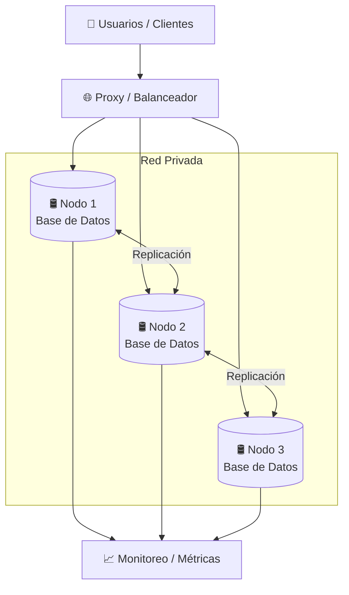

# Objetivos generales

* Diseñar e implementar una arquitectura de bases de datos distribuida que incorpore replicación, alta disponibilidad, tolerancia a fallos, balanceo de carga y monitoreo, con el objetivo de garantizar la continuidad del servicio ante diferentes escenarios de falla. 

# Objetivos específicos

* Comprender los principios de replicación, alta disponibilidad, tolerancia a fallos y recuperación ante incidentes en sistemas de bases de datos.  
* Diseñar una arquitectura distribuida compuesta por múltiples nodos de base de datos.  
* Implementar mecanismos de replicación que permitan mantener la información sincronizada entre los nodos.  
* Configurar un mecanismo de balanceo, proxy o distribución de conexiones hacia los nodos disponibles.  
* Implementar mecanismos de failover que permitan mantener la disponibilidad del servicio ante la caída de uno o más componentes.  
* Realizar pruebas controladas de fallos, recuperación, reintegración de nodos y carga.  
* Implementar una solución de monitoreo que permita visualizar el estado de los nodos y las principales métricas de funcionamiento.  
* Medir indicadores relacionados con disponibilidad, recuperación y pérdida potencial de datos.  
* Documentar la arquitectura, configuración, pruebas realizadas, resultados obtenidos y decisiones técnicas tomadas durante el desarrollo del proyecto.

# Descripción de la actividad

En los sistemas actuales, la disponibilidad de la información es un aspecto crítico. Una arquitectura dependiente de un único servidor de base de datos representa un punto único de fallo que puede provocar interrupciones del servicio, pérdida temporal de acceso a la información e incluso pérdida de datos.

En este proyecto, los estudiantes deberán diseñar e implementar una arquitectura distribuida de bases de datos que permita mantener el servicio disponible ante distintos escenarios de falla.

La solución deberá considerar múltiples nodos de base de datos conectados mediante una red privada, mecanismos de replicación, balanceo o distribución de conexiones, recuperación ante fallos y herramientas de monitoreo.

El proyecto se enfocará principalmente en los siguientes conceptos:

* Replicación de bases de datos.  
* Alta disponibilidad.  
* Tolerancia a fallos.  
* Failover.  
* Balanceo de conexiones.  
* Recuperación de nodos.  
* Monitoreo y observabilidad.  
* Pruebas de carga.  
* Continuidad del servicio.  
* RTO y RPO.

El diseño específico de la arquitectura quedará a criterio de cada grupo. Los estudiantes deberán investigar las alternativas disponibles para el motor de base de datos asignado y justificar técnicamente las decisiones tomadas.

No se proporcionará una solución única de implementación.

# Problema de aplicación

La empresa **Data Bug’s** administra una plataforma que depende de una base de datos central para almacenar información crítica de sus operaciones.

Actualmente, toda la información se encuentra concentrada en un único servidor de base de datos.

Esta arquitectura presenta un riesgo considerable, ya que una falla del servidor, pérdida de conectividad, error del sistema operativo o caída del servicio de base de datos puede provocar la indisponibilidad completa de la plataforma.

La empresa requiere una solución que permita reducir los puntos únicos de fallo y mantener el acceso a la información incluso cuando uno de los componentes de la infraestructura deje de funcionar.

Como profesional en administración de bases de datos, se solicita al grupo diseñar e implementar una arquitectura de alta disponibilidad que permita distribuir la información entre diferentes nodos y mantener el servicio operativo ante escenarios controlados de falla.

La solución deberá permitir demostrar:

* Replicación de información entre nodos.  
* Disponibilidad de los datos ante la caída de un nodo.  
* Redistribución o redirección de conexiones.  
* Recuperación y reintegración de nodos.  
* Monitoreo del estado de la arquitectura.  
* Comportamiento del sistema bajo carga.  
* Medición del tiempo de recuperación.  
* Análisis de posibles pérdidas de información.

# MODALIDAD DEL PROYECTO

El proyecto se realizará en grupos de **tres integrantes**.

Cada integrante deberá participar en la implementación y comprender completamente la arquitectura desarrollada.

Durante la calificación se podrá solicitar a cualquiera de los integrantes:

* Explicar un componente de la arquitectura.  
* Ejecutar una prueba.  
* Modificar una configuración.  
* Recuperar un nodo.  
* Ejecutar una consulta.  
* Explicar los resultados obtenidos.

No será válido dividir el proyecto de forma que un integrante desconozca el funcionamiento de los componentes implementados por los demás miembros.

# MOTOR DE BASE DE DATOS 

El motor de base de datos será asignado según el número de grupo:

| Tipo de grupo | Motor asignado |
| ----- | ----- |
| Grupo par | MySQL |
| Grupo impar | PostgreSQL |

Como referencia:

* MySQL deberá utilizar una versión actual compatible con los mecanismos de replicación seleccionados.  
* PostgreSQL deberá utilizar una versión actual compatible con los mecanismos de replicación seleccionados.

El grupo deberá investigar las alternativas disponibles para implementar la arquitectura requerida.

Se podrán utilizar herramientas adicionales compatibles con el motor asignado para implementar replicación, failover, balanceo y monitoreo.

La herramienta o tecnología seleccionada deberá ser documentada y justificada técnicamente.

# REQUISITOS GENERALES DE LA ARQUITECTURA

La solución deberá contar como mínimo con:

* Tres nodos de base de datos.  
* Nodos ejecutándose en entornos independientes.  
* Comunicación mediante una red privada.  
* Replicación de información entre los nodos.  
* Mecanismo de acceso o distribución de conexiones.  
* Mecanismo de recuperación ante fallos.  
* Monitoreo del estado de los nodos.  
* Dataset de prueba.  
* Pruebas de lectura y escritura.  
* Pruebas de caída y recuperación.

Cada nodo deberá ejecutarse en un entorno independiente.

Podrán utilizarse:

* Máquinas físicas.  
* Máquinas virtuales.  
* Servidores en la nube.  
* Contenedores ejecutándose en hosts diferentes.  
* Una combinación de las alternativas anteriores.

No será válido ejecutar los tres nodos dentro de un único entorno cuya caída provoque la pérdida completa del clúster.

# DISEÑO DE LA ARQUITECTURA 

El grupo deberá diseñar su propia arquitectura de alta disponibilidad.

La implementación técnica de los roles, el mecanismo de replicación y la estrategia de alta disponibilidad quedarán a criterio del grupo, respetando el modelo mínimo del sistema establecido en este documento. 

La solución deberá procurar minimizar los puntos únicos de fallo.

El diseño deberá contemplar como mínimo:

* Nodos encargados de atender operaciones de lectura.  
* Capacidad de realizar operaciones de escritura mientras la arquitectura opere normalmente.  
* Replicación de información.  
* Mecanismo de redirección ante la caída de un nodo.  
* Recuperación de nodos.  
* Acceso a la información durante escenarios de contingencia.

El grupo deberá justificar en el manual técnico:

* Topología seleccionada.  
* Tipo de replicación.  
* Estrategia de failover.  
* Estrategia de balanceo o distribución de conexiones.  
* Función de cada nodo.  
* Ventajas y limitaciones de la arquitectura.  
* Posibles puntos únicos de fallo que permanezcan en la solución.

No se evaluará que todos los grupos implementen exactamente la misma arquitectura. Se evaluará que la solución sea coherente, funcional, resistente a fallos y correctamente justificada.

### Arquitectura mínima
---

#### Componentes y Características

* **Tres nodos de base de datos**
* **Replicación entre nodos**
* **Proxy o balanceador**
* **Red privada**
* **Monitoreo**
* **Continuidad ante la caída de al menos un nodo**

### MODELO MÍNIMO DEL SISTEMA

La arquitectura deberá contar con tres nodos de base de datos y un mecanismo de distribución de conexiones.

Como mínimo, los nodos deberán cumplir los siguientes roles:

* **Nodo 1:** lectura y escritura.  
* **Nodo 2:** lectura y escritura.  
* **Nodo 3:** solo lectura y contingencia.  
* **Proxy o balanceador:** distribuirá las conexiones hacia los nodos disponibles y deberá redirigir el tráfico cuando alguno de los nodos principales falle.

La información deberá mantenerse replicada entre los tres nodos según el mecanismo seleccionado por el grupo.

La arquitectura deberá permitir:

* Ejecutar operaciones de lectura y escritura en los nodos 1 y 2\.  
* Consultar información desde el nodo 3\.  
* Continuar operando cuando uno de los nodos principales falle.  
* Mantener acceso de solo lectura desde el nodo 3 cuando los nodos 1 y 2 no estén disponibles.  
* Recuperar y reintegrar los nodos después de una falla.

El mecanismo específico de replicación, failover y balanceo deberá ser seleccionado, implementado y justificado por el grupo.

# FASES DEL PROYECTO

## Fase 1: Preparación del entorno

El grupo deberá preparar la infraestructura necesaria para ejecutar los nodos de base de datos y los componentes auxiliares de la arquitectura.

Como mínimo deberá:

1. Configurar los tres nodos en entornos independientes.  
2. Configurar la comunicación mediante red privada, VPN o mecanismo equivalente.  
3. Configurar el mecanismo de replicación seleccionado.  
4. Configurar el Nodo 1 y Nodo 2 para lectura y escritura.  
5. Configurar el Nodo 3 como nodo de solo lectura y contingencia.  
6. Integrar el proxy o balanceador.  
7. Verificar la conectividad entre todos los componentes.  
8. Comprobar que los tres nodos se encuentren disponibles.

**Evidencia:** capturas de configuración, estado de nodos, conectividad y diagrama de arquitectura.

## Fase 2: Replicación normal

Se deberá comprobar que la información se replica correctamente entre los nodos según la arquitectura diseñada.

Validar que las operaciones se repliquen correctamente entre los tres nodos.

1. Insertar registros desde el **Nodo 1**.  
2. Verificar los registros en el **Nodo 2** y **Nodo 3**.  
3. Actualizar registros desde el **Nodo 1**.  
4. Verificar los cambios en Nodo 2 y Nodo 3\.  
5. Eliminar registros desde el **Nodo 1**.  
6. Verificar la eliminación en los demás nodos.  
7. Repetir operaciones de inserción, actualización y eliminación desde el **Nodo 2**.  
8. Verificar los cambios en el **Nodo 1** y **Nodo 3**.

**Evidencia:** capturas antes y después, consultas, estado de replicación y logs.

## Fase 3: Fallo de un nodo principal

Validar la disponibilidad ante la caída del primer nodo de lectura y escritura.

1. Verificar que los tres nodos estén funcionando.  
2. Insertar información antes de provocar la falla.  
3. Apagar o detener el servicio del **Nodo 1**.  
4. Verificar que el proxy o balanceador detecte la caída.  
5. Ejecutar operaciones de lectura y escritura en el **Nodo 2**.  
6. Verificar que los cambios se reflejen en el **Nodo 3**.  
7. Encender nuevamente el Nodo 1\.  
8. Verificar que se reintegre y sincronice con los cambios realizados.  
9. Registrar el tiempo de recuperación.

**Evidencia:** estado antes, durante y después de la falla, logs y consultas realizadas.

## Fase 4: Fallo de otro nodo

Se deberá repetir una prueba de falla sobre otro nodo relevante de la arquitectura.

El objetivo será comprobar que la solución no depende exclusivamente de un único servidor.

Validar la disponibilidad ante la caída del segundo nodo de lectura y escritura.

1. Verificar que los tres nodos estén sincronizados.  
2. Apagar o detener el servicio del **Nodo 2**.  
3. Verificar que el proxy o balanceador detecte la caída.  
4. Ejecutar operaciones de lectura y escritura en el **Nodo 1**.  
5. Verificar que los cambios se reflejen en el **Nodo 3**.  
6. Encender nuevamente el Nodo 2\.  
7. Verificar su reintegración y sincronización.  
8. Registrar el tiempo de recuperación.

**Evidencia:** capturas, consultas, logs y estado de sincronización.

## Fase 5: Fallo múltiple

El grupo deberá definir y ejecutar un escenario donde más de un componente deje de estar disponible.

Validar el funcionamiento de emergencia de la arquitectura.

1. Verificar que los tres nodos estén funcionando y sincronizados.  
2. Apagar el **Nodo 1**.  
3. Apagar el **Nodo 2**.  
4. Verificar que las operaciones de escritura ya no estén disponibles.  
5. Ejecutar consultas `SELECT` utilizando el **Nodo 3**.  
6. Comprobar que la información siga disponible en modo de solo lectura.  
7. Encender nuevamente el Nodo 1 o Nodo 2\.  
8. Verificar la recuperación del servicio de escritura.  
9. Encender el nodo restante.  
10. Comprobar la sincronización de los tres nodos.

**Evidencia:** consultas, logs, estado de los nodos y comportamiento del sistema durante la contingencia.

## Fase 6: Pruebas de carga

Validar el comportamiento del balanceo y la resiliencia de la arquitectura bajo carga.

1. Generar una carga controlada de operaciones de lectura y escritura sobre los **Nodos 1 y 2**.  
2. Durante la ejecución de la prueba, cuando se haya completado aproximadamente el **50 % de las operaciones**, provocar la caída de uno de los nodos principales.  
3. Verificar que las operaciones restantes continúen ejecutándose sobre el nodo disponible.  
4. Repetir la prueba provocando la caída del otro nodo principal.  
5. Apagar los **Nodos 1 y 2** y generar una carga únicamente de lectura sobre el **Nodo 3**.  
6. Registrar el comportamiento de la arquitectura en cada escenario.  
7. Comparar los tiempos de respuesta y la disponibilidad antes, durante y después de las fallas.

Como mínimo se deberá medir:

* Cantidad total de operaciones.  
* Operaciones completadas antes de la falla.  
* Operaciones completadas después de la falla.  
* Operaciones fallidas, si existieran.  
* Tiempo de respuesta.  
* Latencia.  
* Disponibilidad del servicio.

**Herramientas recomendadas:** k6, Apache JMeter, Locust o una herramienta equivalente que permita generar una carga controlada de operaciones. La herramienta de generación de carga deberá complementarse con la solución de monitoreo implementada en la Fase 7\. 

## Fase 7: Monitoreo y observabilidad

Implementar una capa de observabilidad que permita visualizar en tiempo real el estado del clúster y de los servidores que lo componen.

1. Seleccionar e instalar una herramienta de monitoreo.  
2. Configurar la recolección de métricas de los tres nodos.  
3. Crear un dashboard que permita visualizar el estado general de la arquitectura.  
4. Ejecutar nuevamente las pruebas de carga definidas en la Fase 6\.  
5. Observar las métricas mientras los Nodos 1 y 2 se encuentran funcionando normalmente.  
6. Provocar la caída de uno de los nodos durante la ejecución de la carga.  
7. Verificar que el cambio de estado pueda observarse desde el dashboard.  
8. Recuperar el nodo y comprobar que vuelva a mostrarse como disponible.  
9. Repetir el monitoreo durante el escenario donde los Nodos 1 y 2 estén fuera de servicio y el Nodo 3 atienda consultas de solo lectura.

Como mínimo se deberán visualizar:

* Uso de CPU.  
* Uso de memoria.  
* Estado del servicio de base de datos.  
* Disponibilidad de cada nodo.  
* Estado o latencia de replicación.  
* Latencia de consultas.  
* Comportamiento durante las pruebas de carga y fallos.

**Herramientas recomendadas:** Prometheus \+ Grafana, Zabbix, Nagios o una herramienta equivalente.

**Evidencia:**

* Capturas del dashboard en operación normal.  
* Capturas durante la prueba de carga.  
* Capturas durante la caída de un nodo.  
* Capturas durante el escenario de contingencia.  
* Logs o archivos de configuración de la herramienta utilizada.

**NOTA:**

*k6 pertenece al ecosistema de Grafana, así que pueden usar k6 \+ Prometheus \+ Grafana y queda bastante integrado.*

## Fase 8: Medición de RTO y RPO

Durante las pruebas de falla, el grupo deberá registrar y analizar:

* RTO: tiempo requerido para recuperar o restablecer el servicio.  
* RPO: cantidad máxima de información que podría perderse ante una falla.

Medir el impacto real de las fallas realizadas.

1. Registrar el momento exacto de la caída de un nodo.  
2. Registrar el momento en que el servicio vuelve a estar disponible.  
3. Calcular el **RTO**.  
4. Generar operaciones antes y durante una falla.  
5. Recuperar el nodo afectado.  
6. Comparar la información antes y después de la recuperación.  
7. Determinar si existió pérdida de datos.  
8. Estimar el **RPO** obtenido.

**Evidencia:** tiempos registrados, comparación de datos y resultados de RTO/RPO.

### Bitácora de pruebas

El grupo deberá llevar una bitácora técnica de las pruebas realizadas durante el desarrollo del proyecto.

Como mínimo deberá registrar:

* Fecha y hora de la prueba.  
* Fase correspondiente.  
* Componente o nodo involucrado.  
* Acción realizada.  
* Resultado esperado.  
* Resultado obtenido.  
* Tiempo de recuperación, cuando corresponda.  
* Evidencia asociada (IMÁGENES).  
* Observaciones.

La bitácora deberá incluir las pruebas de replicación, fallos, recuperación, reintegración de nodos, carga y monitoreo.

Puedes poner una tabla de ejemplo:

| Fecha y hora | Fase | Nodo / componente | Acción realizada | Resultado obtenido | Evidencia | Observaciones |
| :---: | :---: | :---: | :---: | :---: | :---: | :---: |

## Fase 9: Prueba de resiliencia durante la calificación

Durante la calificación, el auxiliar podrá seleccionar un nodo o componente de la arquitectura para simular una falla.

El grupo deberá demostrar el comportamiento de la solución y explicar:

* Qué ocurrió.  
* Cómo respondió la arquitectura.  
* Qué componente asumió el servicio.  
* Si existió pérdida de disponibilidad.  
* Cómo se recuperó la infraestructura.

El escenario exacto será indicado durante la calificación.

## Fase 10: Informe final

El informe técnico deberá incluir:

* Introducción.  
* Arquitectura implementada.  
* Topología de red.  
* Función de cada nodo.  
* Replicación utilizada.  
* Proxy o balanceador.  
* Estrategia de failover.  
* Resultados de las pruebas de replicación.  
* Resultados de las fallas de Nodo 1 y Nodo 2\.  
* Resultados de la falla simultánea.  
* Resultados de las pruebas de carga.  
* Monitoreo y métricas.  
* RTO y RPO obtenidos.  
* Bitácora de pruebas.  
* Ventajas y limitaciones.  
* Mejoras futuras.  
* Conclusiones.

# Importante

* El proyecto se realizará en grupos de tres integrantes.  
* El motor de base de datos será asignado según el número de grupo.  
* Cada grupo deberá diseñar y justificar su propia arquitectura.  
* Se permite utilizar máquinas físicas, virtuales, servidores en la nube o contenedores, siempre que los nodos estén en entornos independientes.  
* La comunicación entre nodos deberá realizarse mediante una red privada o mecanismo equivalente.  
* Se deberá utilizar una herramienta de monitoreo.  
* Se deberán realizar pruebas de replicación, fallos, recuperación y carga.  
* Todos los integrantes deberán comprender completamente la arquitectura implementada.  
* Durante la calificación podrá solicitarse la caída de cualquier nodo o componente de la solución.  
* Se podrá solicitar la modificación de configuraciones o ejecución de pruebas adicionales.  
* No se permite copiar total o parcialmente el trabajo de otro grupo.  
* El uso de herramientas de inteligencia artificial está permitido como apoyo, siempre que el contenido generado sea revisado, adaptado y comprendido.  
* El uso inadecuado de inteligencia artificial tendrá una penalización del 50 % de la nota obtenida.  
* Las copias totales o parciales obtendrán una calificación de cero.  
* Se deberá utilizar Git y GitHub con un mínimo de cinco commits significativos.  
* Las entregas tardías estarán sujetas a las políticas de penalización del curso.

# Entrega 

Los componentes a entregar son:

* Scripts y archivos de configuración utilizados.  
* Configuración de los nodos.  
* Configuración del mecanismo de replicación.  
* Configuración del proxy o balanceador.  
* Configuración de monitoreo.  
* Scripts utilizados para pruebas de carga.  
* Evidencias de las pruebas realizadas.  
* Diagrama de arquitectura.  
* Manual técnico.  
* Análisis de resultados.  
* Conclusiones.
