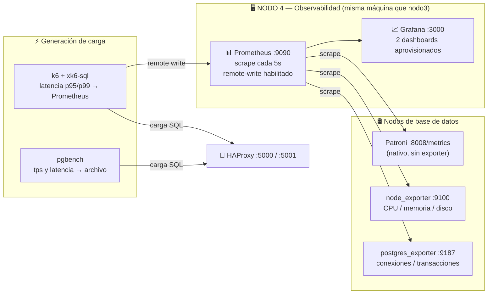

# Resumen técnico — Capa C: Monitoreo (Nodo 4) y Pruebas de Carga (Fase 6)

> **Alcance de este documento.** Cubre únicamente la capa de observabilidad y la
> de generación de carga. La Capa A (PostgreSQL + Patroni + etcd) está descrita en
> `base/README.md`, y la Capa B (HAProxy + keepalived) en `proxy/README.md`.
> Ninguna de las dos fue modificada para construir esto.

---

## 1. Qué problema resuelve esta capa

Hasta la Capa B la arquitectura ya replicaba y conmutaba sola, pero era **ciega**:
la única forma de saber qué estaba pasando era entrar a cada máquina a correr
`patronictl list`. Eso tiene dos consecuencias que el enunciado penaliza:

1. **No hay evidencia observable de los fallos.** La Fase 7 exige un dashboard
   donde se vea, en tiempo real, un nodo caerse y recuperarse.
2. **No hay forma de medir.** Las Fases 6 y 8 piden throughput, latencia,
   operaciones fallidas, RTO y RPO. Sin instrumentación esos números no existen.

Esta capa aporta las dos cosas: **Prometheus + Grafana** para observar, y
**k6 + pgbench** para generar carga controlada y medir.

---

## 2. Arquitectura de la capa



### Por qué el Nodo 4 vive en la máquina de nodo3

No hay una cuarta computadora. Ponerlo junto a nodo3 no es solo una salida
práctica, es la ubicación correcta de las tres posibles: **nodo3 es el único nodo
que sobrevive a todos los escenarios de falla del enunciado** (Fases 3, 4 y 5
tumban nodo1 y/o nodo2). Si el monitoreo viviera en nodo1, se apagaría justo
cuando hay que observar.

**Limitación honesta, para el informe:** si la máquina de nodo3 se apaga, se
pierden simultáneamente el nodo de contingencia y toda la observabilidad. Es un
punto único de fallo que permanece en la solución, y el enunciado pide
declararlos explícitamente. Además, Prometheus, Grafana y k6 consumen CPU en esa
misma máquina, lo que introduce algo de ruido en las métricas de nodo3 durante
las pruebas de carga.

---

## 3. Decisiones técnicas y su justificación

### 3.1 Patroni ya expone métricas: no se necesita un exporter para el clúster

Patroni 4.1.5 publica un endpoint `/metrics` en formato Prometheus sobre su
**mismo puerto REST 8008**, que la Capa B ya tiene abierto y que HAProxy ya
consulta para sus health checks. Esto evita instalar un exporter adicional y, más
importante, evita tocar la configuración de los compañeros.

De ahí salen las métricas más difíciles de obtener por otros medios:

| Métrica | Requisito de la Fase 7 que cubre |
|---|---|
| `patroni_postgres_running` | Estado del servicio de base de datos |
| `patroni_primary`, `patroni_replica`, `patroni_sync_standby` | Rol y disponibilidad de cada nodo |
| `patroni_xlog_location`, `patroni_xlog_replayed_location` | **Latencia de replicación** |
| `patroni_postgres_timeline` | Evidencia histórica de los failovers |
| `patroni_cluster_unlocked` | Clúster sin líder (contingencia de Fase 5) |
| `patroni_dcs_last_seen` | Salud del consenso (etcd) |

### 3.2 Los agentes viven en el compose general, bajo dos perfiles

`node_exporter` y `postgres_exporter` están declarados en el
`docker-compose.yml` principal con `profiles: ["nodo-bd", "monitoreo-agente"]`.
Al compartir el perfil `nodo-bd` suben junto con el clúster, así que los tres
nodos levantan todo con **un solo comando**; el perfil propio permite además
reiniciarlos solos sin tocar la base de datos.

El stack de observabilidad (Prometheus + Grafana) va bajo `profiles:
["monitoreo"]`, que **solo nodo3 activa**: es un único punto de recolección para
los tres. Ese perfil ya estaba reservado como comentario en el compose por el
compañero de la Capa B, esperando esta capa.

Las definiciones de `etcd`, `patroni`, `haproxy` y `keepalived` no se tocaron:
el cambio es aditivo y se verificó comparando la configuración resuelta por
`docker compose config` antes y después.

`postgres_exporter` apunta al Postgres **local** de cada nodo (`127.0.0.1:5432`),
nunca al proxy. Cada nodo debe reportar su propio estado: si Patroni tiene su
Postgres abajo, el exporter publica `pg_up=0`, que es justamente la señal de
"servicio caído" que pide el enunciado.

### 3.3 Una sola configuración de Prometheus para simulación y distribuido

`monitoreo/prometheus/entrypoint.sh` genera `prometheus.yml` en cada arranque a
partir de variables de entorno. El mismo stack sirve apuntando a nombres de
contenedor (simulación local) o a IPs de Tailscale (despliegue real), sin
mantener dos archivos divergentes.

Cada serie se etiqueta con `nodo="nodo1|nodo2|nodo3"`, y **todos** los paneles de
Grafana se construyen sobre esa etiqueta. Es lo que permite que una misma gráfica
compare los tres nodos lado a lado.

### 3.4 Los dashboards se aprovisionan desde archivos versionados

No se crean a mano en la UI. Viven como JSON en
`monitoreo/grafana/dashboards/` y se cargan por provisioning. Dos razones: si se
borra el contenedor no se pierde nada, y quedan como **evidencia reproducible**
dentro del repositorio, que es parte de lo que se entrega.

### 3.5 Dos generadores de carga, no uno

| Herramienta | Rol | Por qué |
|---|---|---|
| **k6 + xk6-sql** | Principal | Es lo que el enunciado sugiere explícitamente; escribe por remote-write a Prometheus, así que la latencia aparece en Grafana junto al estado del clúster |
| **pgbench** | Respaldo | Viene dentro de la imagen de Postgres del proyecto: cero instalación, resultados inmediatos |

k6 no habla SQL de fábrica (solo HTTP, gRPC y WebSocket), así que hubo que
compilar un binario propio con `xk6`. Ese build está en `carga/k6/Dockerfile` y
requiere Go 1.26. Si falla en otra máquina, `carga/pgbench/run-carga.sh` cubre la
Fase 6 sin compilar nada.

### 3.6 La carga apunta al proxy, nunca a un nodo directo

Tanto k6 como pgbench golpean los puertos **5000** (escritura) y **5001**
(lectura) de HAProxy. Apuntar directo a un nodo mediría la base de datos, no la
arquitectura: el objetivo de la Fase 6 es demostrar que el balanceo y el failover
son transparentes para el cliente.

**Detalle operativo importante:** la carga se genera desde la máquina de nodo3
contra **su propio HAProxy local**. Si se generara contra el HAProxy de nodo1 y
luego se apagara nodo1, se perdería el proxy junto con el nodo y la prueba se
cortaría en vez de demostrar el failover.

### 3.7 Por qué la latencia de consultas no usa `pg_stat_statements`

La forma canónica de medir latencia del lado del servidor sería la extensión
`pg_stat_statements`, pero exige agregarla a `shared_preload_libraries`, lo que
significa modificar `base/bootstrap.yml.template` (capa del compañero) y
**reiniciar los tres Postgres**. Se optó por medir la latencia del lado del
cliente con k6, que es lo que percibe la aplicación real, cumple el requisito y
no toca nada ajeno.

---

## 4. Qué se entrega

```
docker-compose.yml                   # los servicios de esta capa se agregaron aquí:
                                     #   node-exporter, postgres-exporter → perfil "nodo-bd"
                                     #   prometheus, grafana             → perfil "monitoreo"
monitoreo/
├── prometheus/entrypoint.sh         # genera prometheus.yml desde el entorno
└── grafana/
    ├── provisioning/                # datasource y proveedor de dashboards
    └── dashboards/
        ├── 01-cluster-estado.json   # Fase 7
        └── 02-carga-fallos.json     # Fases 6 y 8

carga/
├── dataset/01-esquema.sql           # dataset de prueba (requisito del enunciado)
├── pgbench/{escritura,lectura}.sql  # scripts de carga
├── pgbench/run-carga.sh             # orquesta los 3 escenarios de la Fase 6
├── k6/Dockerfile                    # build de k6 con xk6-sql
├── k6/carga-mixta.js                # escenarios 1 y 2 (lectura + escritura)
├── k6/carga-lectura.js              # escenario 3 (contingencia, solo lectura)
└── resultados/                      # salidas con marca de tiempo

docker-compose.local-sim.monitoreo.yml   # override para validar todo en una sola PC
```

### Dataset de prueba

Modela la plataforma de "Data Bug's" del enunciado:

| Tabla | Registros | Propósito |
|---|---|---|
| `databugs.clientes` | 1.000 | Entidad base |
| `databugs.productos` | 200 | Entidad base |
| `databugs.transacciones` | 20.000 semilla + las que inserte la carga | Tabla caliente de la prueba |
| `databugs.bitacora_pruebas` | — | Registra `inet_server_addr()` y `clock_timestamp()` en cada INSERT, para calcular el **RPO** comparando lo escrito antes de la caída contra lo que sobrevivió |

---

## 5. Resultados de la validación en simulación local

> ⚠️ **Estos números son de la simulación en una sola máquina**
> (`docker-compose.local-sim.yml`), donde los tres "nodos" son contenedores sin
> latencia de red real. **No son los resultados del despliegue distribuido** y no
> deben presentarse como tales. Sirven para demostrar que el instrumental
> funciona; los números definitivos salen de las pruebas con el equipo sobre
> Tailscale.

**Monitoreo:** los 10 targets de Prometheus reportaron `up`, y las consultas de
los dos dashboards devolvieron datos: líder identificado, lag de replicación por
nodo, CPU, memoria y conexiones activas.

**Carga con k6 (100 s, 5 VUs escritura + 10 VUs lectura), tumbando al líder a
mitad de la corrida:**

| Métrica | Valor |
|---|---|
| Iteraciones completadas | 13.983 |
| Operaciones exitosas | 11.804 |
| Operaciones fallidas | 2.179 (ventana de failover) |
| Latencia de escritura | avg 2,65 ms · p95 4 ms · max 21 ms |
| Latencia de lectura | avg 0,68 ms · p95 1 ms |
| Iteración más lenta | 12,1 s (la que quedó atrapada en el failover) |

**Carga con pgbench (20 s, 5 clientes, mixta):**

| Escenario | TPS | Latencia media | Fallidas |
|---|---|---|---|
| Lectura (puerto 5001) | 10.252 | 0,486 ms | 0 |
| Escritura (puerto 5000) | 1.133 | 4,411 ms | 0 |

**Failover observado:** parada del líder a las `15:17:42`, nodo2 confirmado como
Leader en timeline 2 a las `15:17:50` → **RTO ≈ 8 s** con parada controlada.
nodo1 se reintegró después como `Sync Standby` con lag 0.

---

## 6. Advertencias que valen para la interpretación de resultados

- **El RTO depende de cómo se tumbe el nodo.** Con `docker compose stop patroni`
  Patroni libera el leader lock al apagarse y el failover toma segundos. Con una
  caída abrupta (máquina apagada, red cortada) hay que esperar a que expire el
  `ttl: 30` de la configuración, y el RTO sube a ~30 s o más. Ambos escenarios
  deben medirse y documentarse por separado.
- **Cuidado con `docker kill`.** Los servicios llevan `restart: unless-stopped`:
  un contenedor matado con `kill` se reinicia solo de inmediato y arruina la
  prueba. Para simular una caída abrupta sirve mejor `sudo tailscale down` en el
  nodo afectado, que corta la red sin que el contenedor reviva.
- **El standby síncrono tarda un ciclo de `loop_wait` (~10-30 s)** en aparecer
  después de que las réplicas conectan. Consultado antes, `patroni_sync_standby`
  vale 0 en los tres nodos. No es un fallo.
- **El líder se excluye del panel de lag.** No replaya WAL, así que su
  `patroni_xlog_replayed_location` es 0 y aparecería con un lag falso enorme. Los
  paneles filtran con `and (patroni_primary == 0)`.
- **k6 exporta las latencias a Prometheus en segundos**, aunque su resumen en
  consola las muestre en milisegundos. Los paneles están en unidad `s`.
